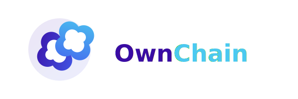

# OwnChain



> Creation is Asset, Social is Ownable

OwnChain is a revolutionary social media token layer protocol designed to add ownership, value capture, and cross-platform interoperability layers to existing social media platforms through blockchain technology. We are not creating another social media platform, but building the underlying value infrastructure for all existing and future social media.

## Project Vision and Mission

**Vision**: Redefine the economic model of social media, allowing creators and users to truly own and benefit from their content and data.

**Mission**:
- Provide a unified tokenization layer for social media platforms
- Enable cross-platform content value capture for creators
- Empower users with ownership and control over their personal data
- Create a more fair and transparent social media economic system

## Technology Stack

### Blockchain
- **Ethereum Virtual Machine (EVM)** - Primary blockchain environment
- **Solidity** - Smart contract programming language
- **Hardhat** - Development environment for Ethereum software
- **Ethers.js** - Library for interacting with the Ethereum blockchain

### Testing & Quality Assurance
- **Mocha/Chai** - Testing framework
- **Solidity Coverage** - Code coverage for Solidity testing
- **Slither** - Static analyzer for Solidity
- **Mythril** - Security analysis tool for EVM bytecode

### Frontend Integration
- **Web3.js** - JavaScript library for Ethereum integration
- **React** - Reference implementation for dApp interfaces
- **TypeScript** - Type-safe programming language

## Architecture

### Core Components

#### 1. Token System
- **OwnToken (OWN)** - ERC-20 utility token for platform governance and value exchange
- **Token Economics** - Deflationary model with transaction fee mechanism
- **Team Token Vesting** - Time-locked smart contracts for team token allocation

#### 2. Content Ownership
- **Content Registration** - On-chain verification of content ownership
- **Cross-Platform Verification** - Unified identity and content verification across platforms
- **Ownership Transfer** - Secure mechanisms for transferring content rights

#### 3. Content Monetization
- **Creator Rewards** - Direct monetization for content creators
- **Support Mechanisms** - Fan-to-creator direct support infrastructure
- **Fee Distribution** - Transparent fee allocation between platform and creators

#### 4. Governance
- **DAO Structure** - Decentralized governance for protocol decisions
- **Proposal System** - Community-driven improvement proposals
- **Voting Mechanism** - Token-weighted voting for protocol changes

## Project Structure

```
contracts/          # Smart contract code
├── token/          # Token-related contracts
├── content/        # Content ownership and verification contracts
docs/               # Documentation
├── api/            # API documentation
scripts/            # Deployment and testing scripts
test/               # Test code
```

## Development Environment Setup

### Prerequisites

- Node.js >= 14.0.0
- npm >= 6.0.0
- Hardhat

### Installation

```bash
npm install
```

### Compile Contracts

```bash
npx hardhat compile
```

### Run Tests

```bash
npx hardhat test
```

### Deploy Contracts

```bash
npx hardhat run scripts/deploy.js --network <network-name>
```

## API Documentation

Comprehensive API documentation is available in the [docs/api](docs/api/) directory, covering:
- OwnToken contract interfaces
- Content ownership registration and verification
- Content monetization mechanisms
- Integration examples for platforms and developers

## Roadmap

### Phase 1: Foundation (Q2 2023)
- Core smart contract development
- Testing and security audits
- Initial documentation

### Phase 2: Launch (Q3 2023)
- Mainnet deployment
- Developer SDK release
- First platform integrations

### Phase 3: Expansion (Q4 2023)
- Cross-chain compatibility
- Enhanced governance features
- Advanced monetization options

### Phase 4: Ecosystem (2024)
- Third-party developer ecosystem
- Global platform adoption
- DAO-driven development

## Contributing

We welcome contributions from the community! Please see our [Contributing Guidelines](CONTRIBUTING.md) for more information on how to get involved.

## Security

Security is our top priority. If you discover a security vulnerability, please send an email to security@ownchain.io. Please do not create public GitHub issues for security vulnerabilities.

## License

This project is licensed under the [MIT License](LICENSE).

## Contact

- Website: [ownchain.io](https://ownchain.io)
- X (Twitter): [@OwnChain_com](https://x.com/OwnChain_com)
- Email: info@ownchain.io 